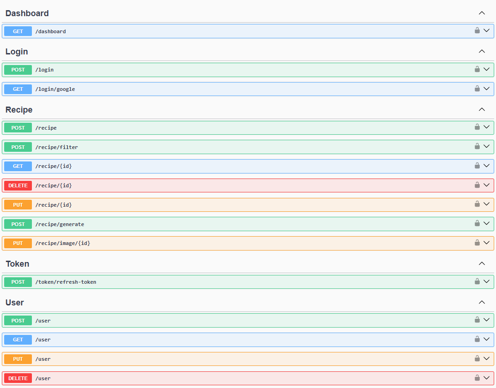

## Sobre o Projeto

O **MyRecipeBook** é uma API desenvolvida em **.NET 8**, com foco em auxiliar pessoas que desejam gerenciar suas receitas culinárias de forma simples, organizada e segura.

Com ele, é possível cadastrar usuários, criar receitas detalhadas, aplicar filtros, editar ou excluir receitas já existentes, além de incluir informações adicionais como tempo de preparo, nível de dificuldade e imagens ilustrativas.

O projeto é **Orientado a Interfaces** e segue os princípios do **Domain-Driven Design (DDD)** e **SOLID**, buscando uma arquitetura modular, de fácil manutenção e alinhada a boas práticas de desenvolvimento. Toda a comunicação é feita seguindo o padrão **REST**, com suporte a documentação interativa via **Swagger**.

Além disso, o **My Recipe Book** implementa autenticação segura via **JWT** e **Refresh Token**, conta com integração ao **Google Login**, e ainda oferece uma funcionalidade extra: geração de receitas com base nos ingredientes informados, utilizando a API do **ChatGPT**.

---

### Features

- **Gerenciamento de Receitas**: Criação, edição, exclusão e filtro de receitas. 🍲✏️🗑️🔍  
- **Login com Google**: Autenticação simplificada via conta Google. 🔑🔗  
- **Integração com IA**: Geração de receitas personalizadas pelo Chat-GPT a partir de ingredientes fornecidos. 🤖🍳  
- **Mensageria**: Uso de **Service Bus (Queue)** para gerenciar solicitações de exclusão de contas. 📩  
- **Upload de Imagens**: Inclusão de imagens para ilustrar receitas. 📸  
- **Banco de Dados Flexível**: Suporte tanto para **MySQL** quanto para **SQL Server**. 🗄️  
- **Validação de Dados**: Implementação com **FluentValidation**. ✅  
- **Testes de Validação, Unidade e Integração**: Garantindo confiabilidade e qualidade do código. 🧪  

---

### Arquitetura e Tecnologias Utilizadas

- **.NET 8**  
- **Entity Framework Core** (MySQL / SQL Server)  
- **FluentValidation** (validações)
- **Shouldly** (testes mais limpos) 
- **AutoMapper** (mapeamento entre objetos)  
- **Swagger** (documentação e testes de API)  
- **JWT & Refresh Token** (autenticação segura)  
- **Google Authentication**  
- **Service Bus - Queue** (mensageria)  
- **Integração com ChatGPT**  
- **Docker** (containerização)  
- **Azure DevOps** (CI/CD)  
- **SonarCloud** (análise contínua de qualidade de código)  

---

### Exemplos de Tela

  

---

## Getting Started

Para executar o projeto localmente, siga os passos abaixo.

### Requisitos

- Visual Studio 2022+ ou Visual Studio Code  
- Windows 10+ com [.NET SDK][dot-net-sdk] instalado  
- MySQL ou SQL Server  
- Docker (opcional, para execução em container)  

### Instalação

1. Clone o repositório:  
    ```sh
    git clone https://github.com/Will-Ribeiro00/MyRecipeBook.git
    ```
2. Configure o arquivo `appsettings.Development.json` com as informações do seu banco de dados e chaves de autenticação.  
3. Execute a aplicação:  
    ```sh
    dotnet run
    ```
4. Acesse o Swagger em:  
    ```
    https://localhost:{porta}/swagger
    ```

---

<!-- Links -->
[dot-net-sdk]: https://dotnet.microsoft.com/en-us/download/dotnet/8.0

<!-- Badges -->
![badge-dot-net]
![badge-windows]
![badge-visual-studio]
![badge-mysql]
![badge-sqlserver]
![badge-swagger]
![badge-docker]
![badge-azure-devops]
![badge-azure]
![badge-google]
![badge-openai]
![badge-sonarcloud]

[badge-dot-net]: https://img.shields.io/badge/.NET-512BD4?logo=dotnet&logoColor=fff&style=for-the-badge
[badge-windows]: https://img.shields.io/badge/Windows-0078D4?logo=windows&logoColor=fff&style=for-the-badge
[badge-visual-studio]: https://img.shields.io/badge/Visual%20Studio-5C2D91?logo=visualstudio&logoColor=fff&style=for-the-badge
[badge-mysql]: https://img.shields.io/badge/MySQL-4479A1?logo=mysql&logoColor=fff&style=for-the-badge
[badge-sqlserver]: https://img.shields.io/badge/Microsoft%20SQL%20Server-CC2927?logo=microsoftsqlserver&logoColor=fff&style=for-the-badge
[badge-swagger]: https://img.shields.io/badge/Swagger-85EA2D?logo=swagger&logoColor=000&style=for-the-badge
[badge-docker]: https://img.shields.io/badge/Docker-2496ED?logo=docker&logoColor=fff&style=for-the-badge
[badge-azure-devops]: https://img.shields.io/badge/Azure%20DevOps-0078D7?logo=azuredevops&logoColor=fff&style=for-the-badge
[badge-azure]: https://img.shields.io/badge/Microsoft%20Azure-0078D4?logo=microsoftazure&logoColor=fff&style=for-the-badge
[badge-google]: https://img.shields.io/badge/Google-4285F4?logo=google&logoColor=fff&style=for-the-badge
[badge-openai]: https://img.shields.io/badge/OpenAI-412991?logo=openai&logoColor=fff&style=for-the-badge
[badge-sonarcloud]: https://img.shields.io/badge/SonarCloud-F3702A?logo=sonarcloud&logoColor=fff&style=for-the-badge
